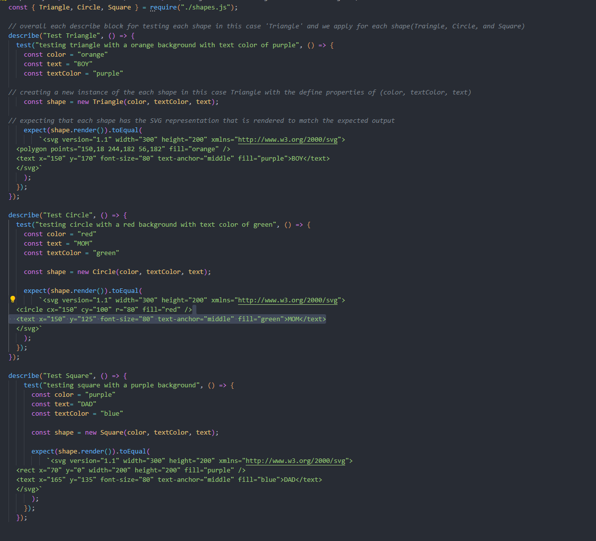

## Description 
Welcome to "Make-me-logo"! This is a simple application that will create a logo consisiting of three shapes(Circle, Triangle, Square). Within those shapes, the user can select up to three letters to be inputted in their logo. Each shape and letter will have the opportunity to represent a color of the users choice. 

## Technology Used
* Node.js
* Inquirer.js
* FS (File System)
* Jest
* Disclaimer: all these technologies/packages must be installed within your CLI before you can experience this application 

## Installation
To have an idea on how this application is operated. Please follow this video for reference
Video Walkthrough! Click [here](https://drive.google.com/file/d/1vVYWHpPmwoiEKe1OfNtPATxcfYDmaDvT/view)

## Code Highlights

## Learning Points
* Usage of Jest Npm package allows us to ensure our development/project of any errors before deployment. 
* Applying other npm packages (inquirer/fs) to create a file based on our test.

